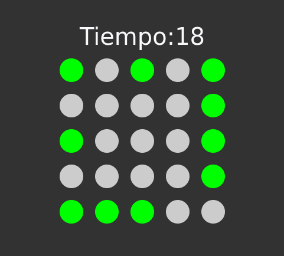
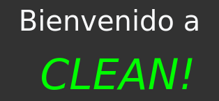

# CLEAN!

## Introduccion:
Este proyecto es un juego que consiste en clickear todos los círculos verdes en un tiempo determinado que va disminuyendo mientras aumentan los niveles.

## Tecnologías:
El proyecto utiliza Svelte para la lógica de la interfaz de usuario, JavaScript para el conteo de tiempo y Bootstrap para el estilo de los componentes.

   

## Dinámica:
El juego consiste en convertir a gris todos los círculos en verde antes que se acabe el tiempo si lo consigues a tiempo obtienes en tu pantalla un <i class="clean">CLEAN!</i> y pasarás al siguiente nivel

## Cómo jugar:
Se puede acceder al juego a través del link: 
[Link al juego](https://larahost.net/clean/)

Aca se te dará una explicación más práctica de como jugar al juego.

## Cómo funciona:
Hablando desde la lógica de programación, primero se crea un array con las configuraciones de los primeros niveles (el resto serán generados automáticamente). Se crea un objeto <code>currentLevel</code> que guardará las configuraciones del nivel, estas configuraciones cuentan con <code>columns, rows, notClickeds, time, gap</code>. Luego se crea un Array de longitud <code>columns * rows</code> y contiene <code>notClickeds</code> elementos <code>false</code> y el resto elementos <code>true</code>. Luego se desordena este array y queda como <code>currentArray</code>. Luego se mapea este <code>currentArray</code> para generar los círculos con un atributo <code>clicked</code> que es igual al índice del <code>currentArray</code> y con una función <code>on:click</code> que aumenta un contador <code>clickeds</code>. Todos estos circulos son metidos dentro de un div con <code>display: grid</code> y con filas y columnas del objeto <code>currentLevel</code>. Ya luego se hace la implementación del tiempo y se evalúa la cantidad de la variable <code>clickeds</code> comparado con la cantidad de <code>notClickeds</code> del objeto <code>currentLevel</code>.

## Contribuciones
Si deseas contribuir a este proyecto, por favor crea un fork del repositorio y envía un pull request con tus cambios. Estaremos felices de revisar tus contribuciones y discutirlas contigo.

## Licencia
Este proyecto está bajo la licencia MIT. Si deseas utilizar el código en tu propio proyecto, por favor asegúrate de leer y respetar los términos de la licencia.

